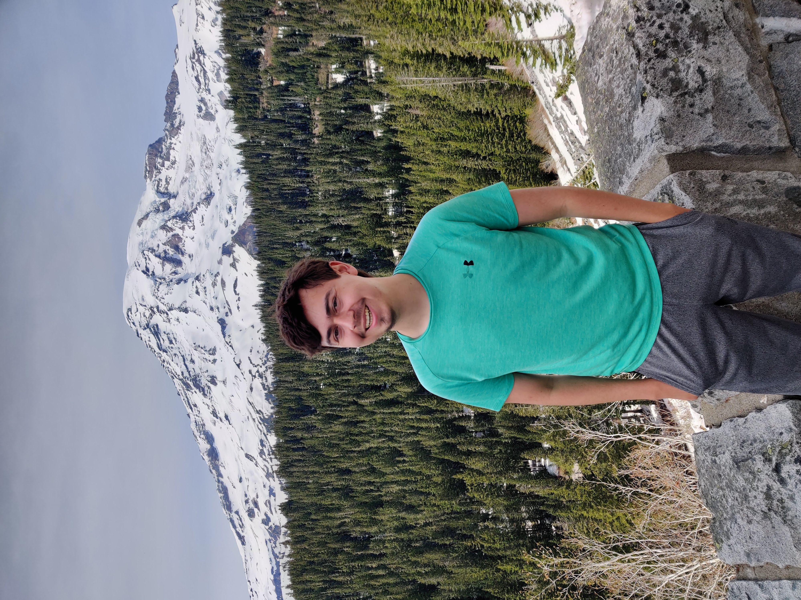

# Open Source Software - Spring 2022
## (( Ryan Schnur ))

## Bio
Hi I am Ryan Schnur and I am from Long Island NY and a Senoir hear at RPI. I have a Full time offer from Amazon and can't wait to finish school and start my life in Seattle

Discord handle - itsallGoodman#9926

## Lab Reports
[Lab 1](labs/lab-01/report.md)
[Lab 2](labs/lab-02/report.md)
[Lab 3](labs/lab-03/report.md)
[Lab 4](labs/lab-04/report.md)
[Lab 5](labs/lab-05/report.md)
[Lab 6](labs/lab-06/report.md)
[Lab 7](labs/lab-07/report.md)
[Lab 8](labs/lab-08/report.md)
[Lab 9](labs/lab-09/report.md)
[Lab 10](labs/lab-10/report.md)