# Lab 01 Report - Introduction to Open Source Software
0.3

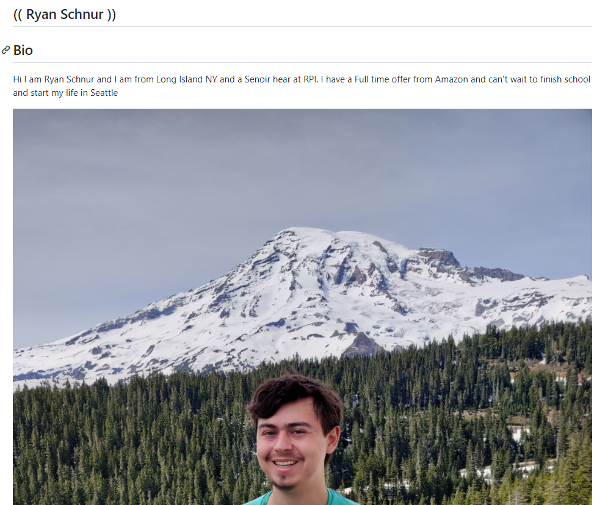

2 Reading

2.1 It is important to understand Open Source Definitions so you can participate in conversations about Open Source topics. Also when using Open Source resources it comes in handy to understand what you are working with and the community around it.

2.3

2.3.1 If you have knowledgeable person around you can ask them before posting a question.
2.3.2 Don't expect an answer right away when asking a question

2.4 I found this story very interesting and relatable due to it being an RPI student who wants to work in tech. I learned that someone does not have to be in tech to make advancements. Jesse was not very familiar with search engines but still managed to make a major improvement. The chapter also brought up how useful open source can be. Jesse took the existing search engine and fixed a small problem that caused computers to crash, improving the sharing system. This improved the search engine but had the side effect of people sharing a ton ,1/3 of all, files on the engine to each other. It was also interesting that Jesse was not the only one tinkering with search engines since other students from other schools were also involved. If they had been connected maybe they would have made more changes to the search engines. Finally I saw that the law was messed up due to Jesse really doing nothing wrong, but due to our law system having to take the plea deal which suggested he was guilty and out $12,000.

3 Linux

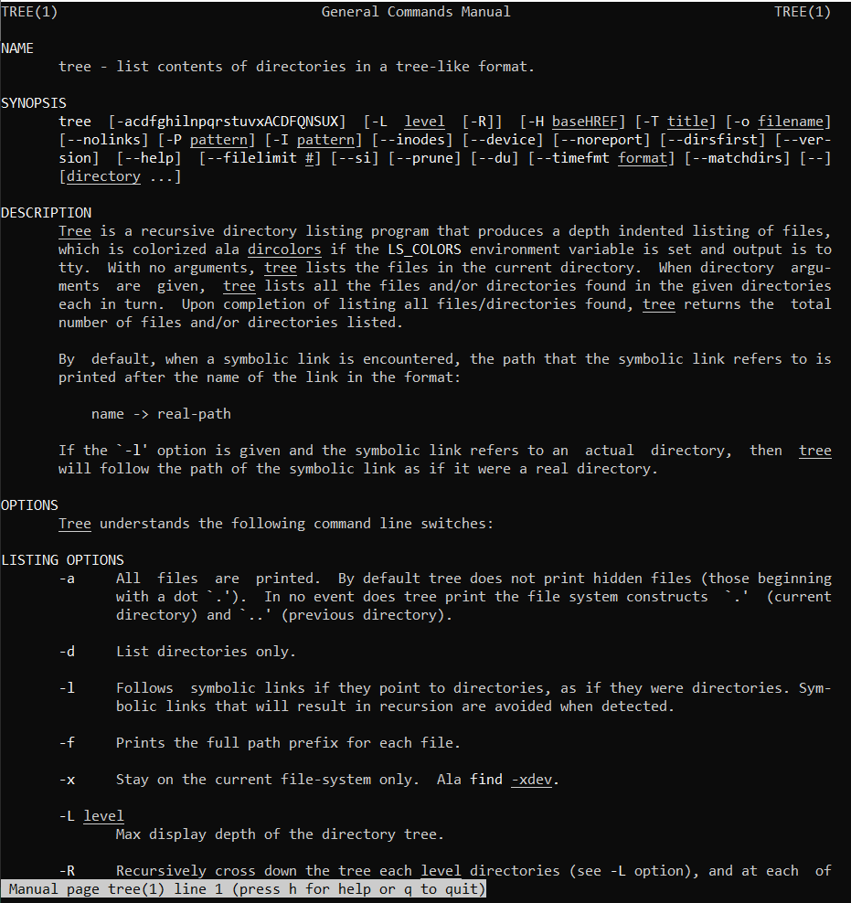

4.1 Regex Problems

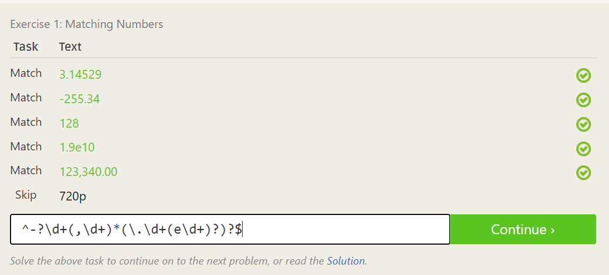
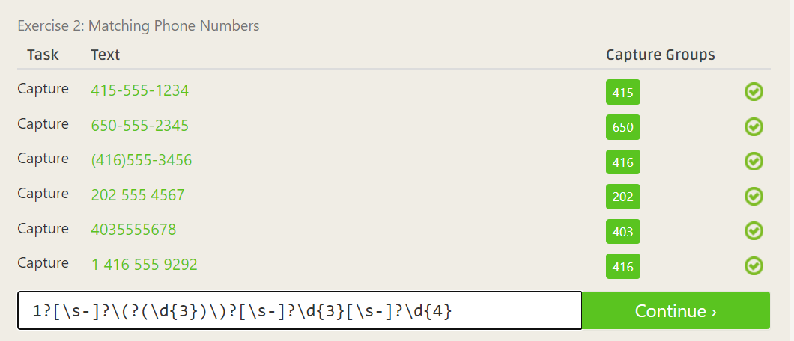
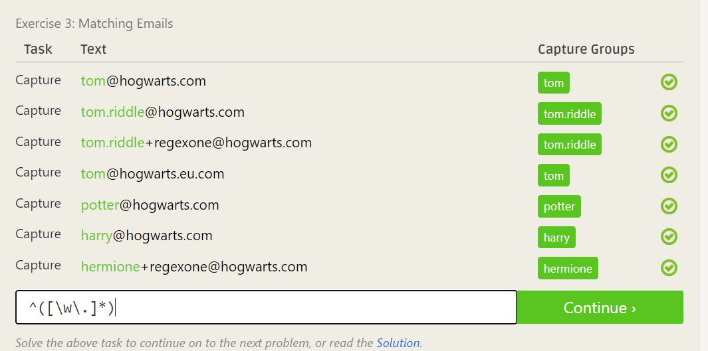
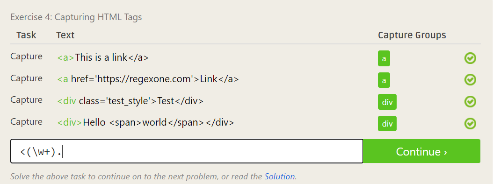
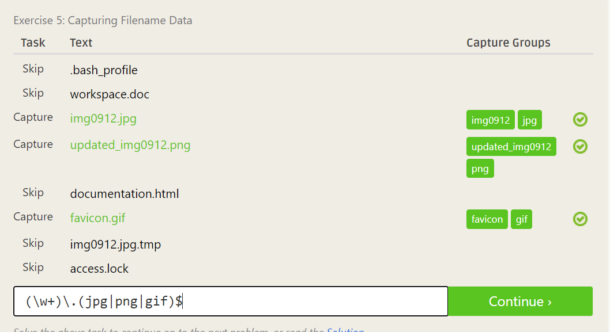
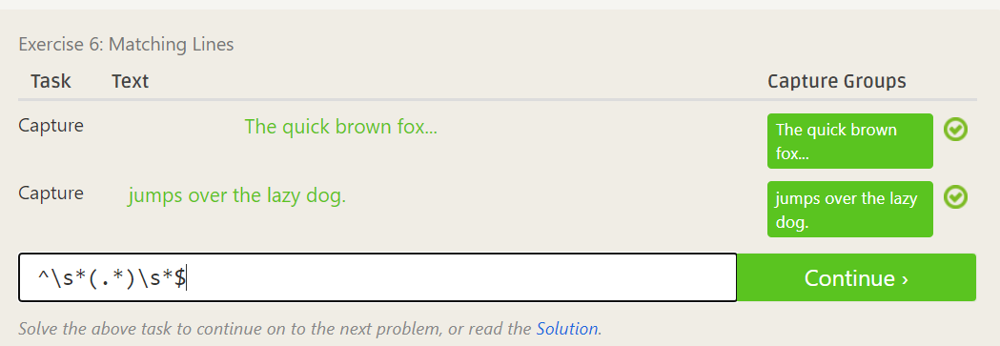
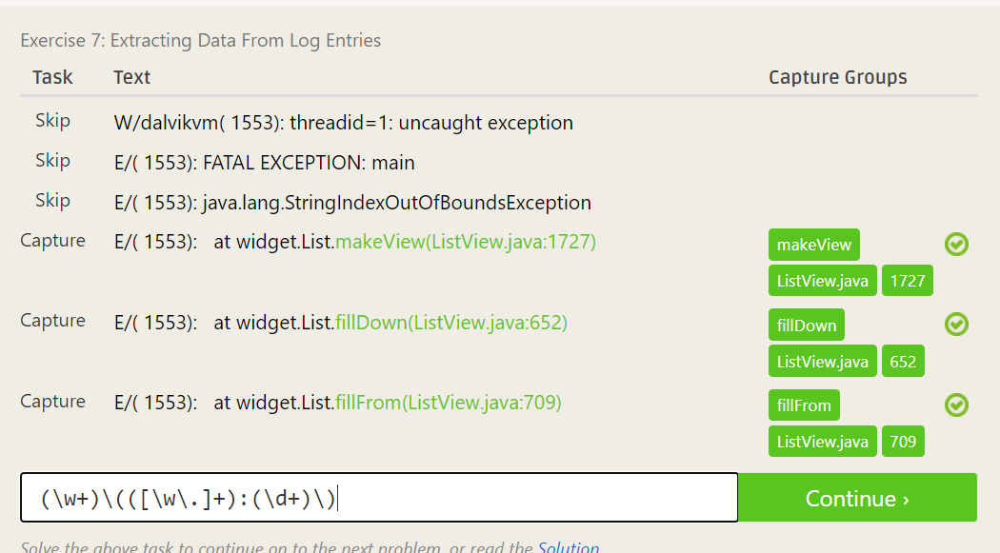

4.2 Regex Crosswords

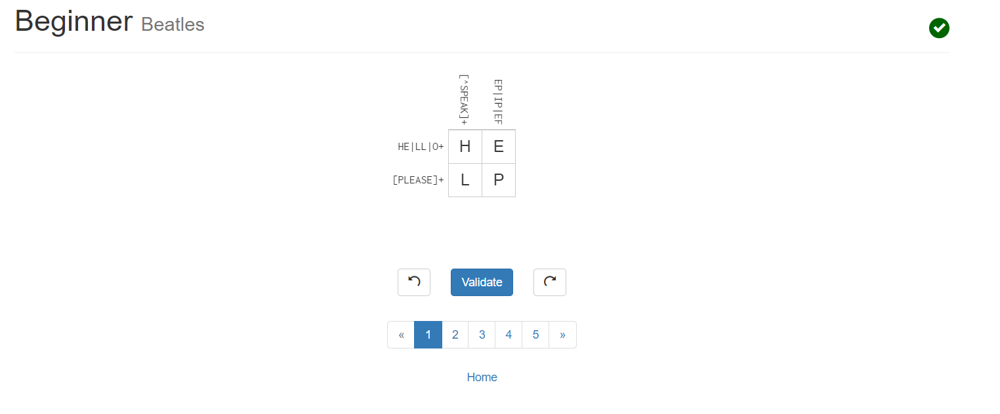
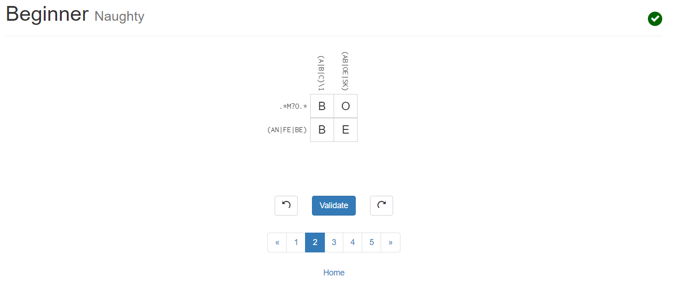
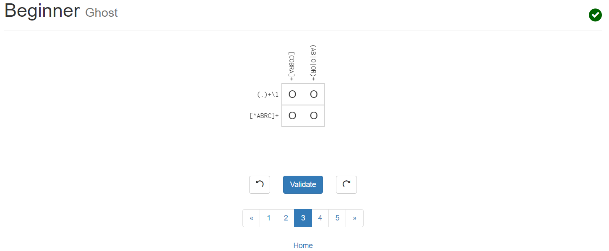
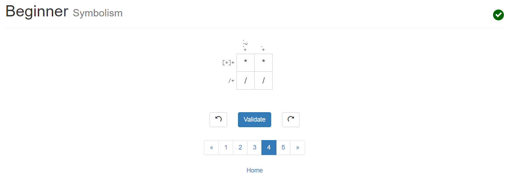

5 Blockly

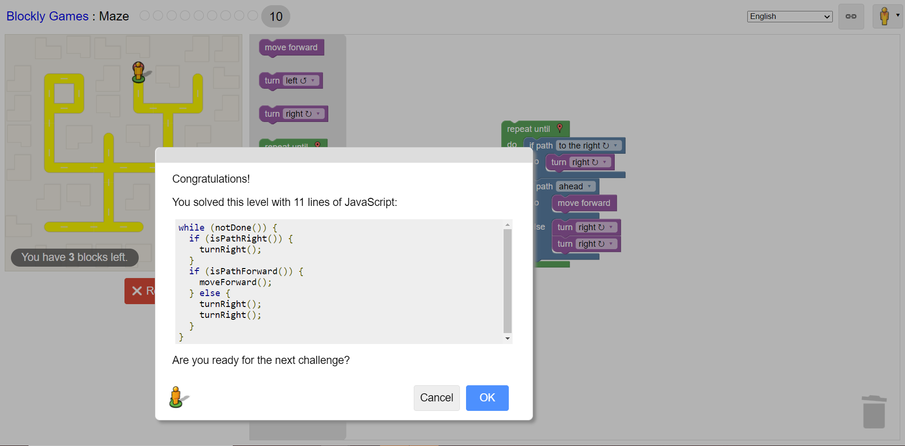

6 Reflection

6.1 Currently looking at Dog Bed Database.
6.3 Doing this lab report on VS Code. I started the assignment in class but finished later. If given full 1:50 of time I would have finished in class. Thought the lab was fun.