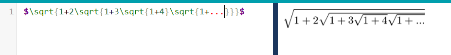
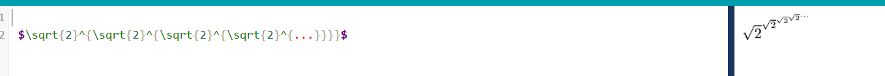
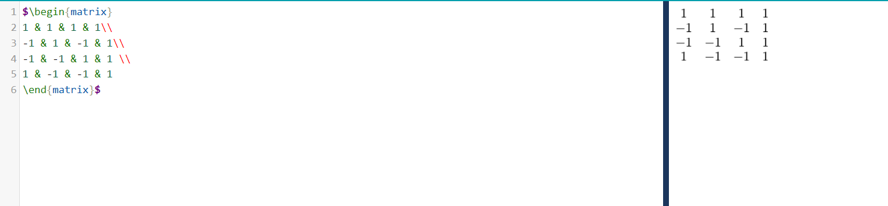
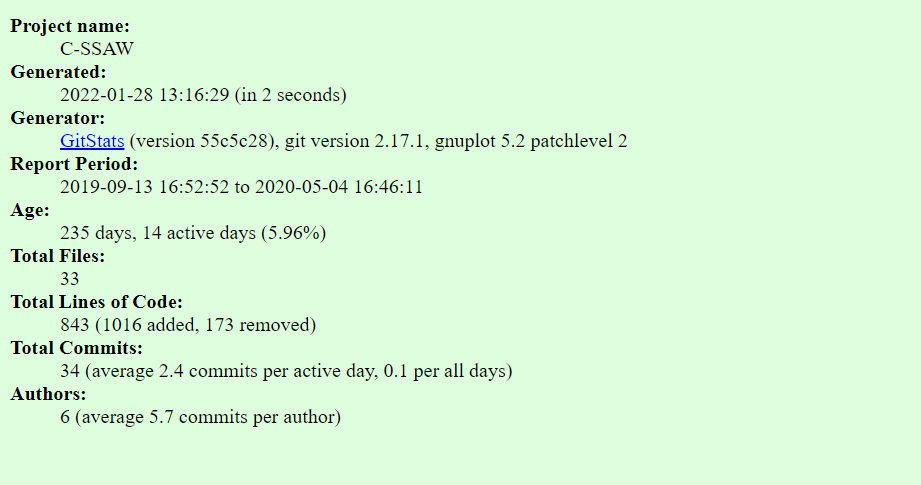

# Documentation

1. 
Wiki created

2. 
Welcome to the oss-repo-template wiki for Ryan Schnur!

I'm interested in multiple areas such as AI,Webdev, or Gamedev due to my low experience in the topics. Projects that I find interesting are Wrathskeller (Frank Matranga is a good friend of mine) and an interactive map for witcher 3 (https://github.com/witcher3map/witcher3map) (I'm a big fan of the game and books). If neither of those projects pans out I would be open to projects that use Pytorch, React, Godot, or other tools that fall under the topics I would like to explore. At the end of the semester, I hope to have a well-documented project that has at least the basics but can easily be added to form other contributors.

3.

4.

# Community

Parts 1,2,3 don't have info to submit

4. 

# Campus Watch
2 contributors
2690 lines
First commit was on Jan 18, 2019
Last commit was on Apr 17, 2019
There are 13 branches
Gitstats
# Campvs
4 contributors
1549 lines of code
First commit - Mar 13, 2016
Last commit - May 12, 2017
1 branch - master
Gitstats
# Butter-Project
3 contributors
158821 lines of code
First commit - Feb 19, 2014
Last commit - May 03, 2016
9 branches - master, etc.
Gitstats
# C-SSAW
4 Contributors
13657 lines of code
c6eef16dbc7d60453fe953f6915dfa9605bab85c on Sep 13/2019 first commit
1f11c05d53359d4e28dead1f6e53e82d9057ef51 on May 4/2020 last commit
6 current breanches
Gitstats

5.
# Campus Watch

# Campvs

# Butter-Project

# C-SSAW

6. Did not work Seg Fault

