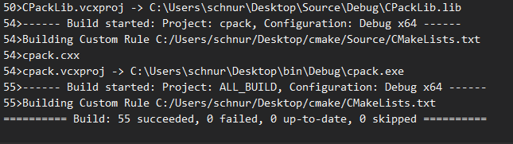
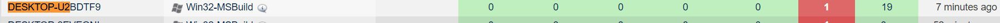
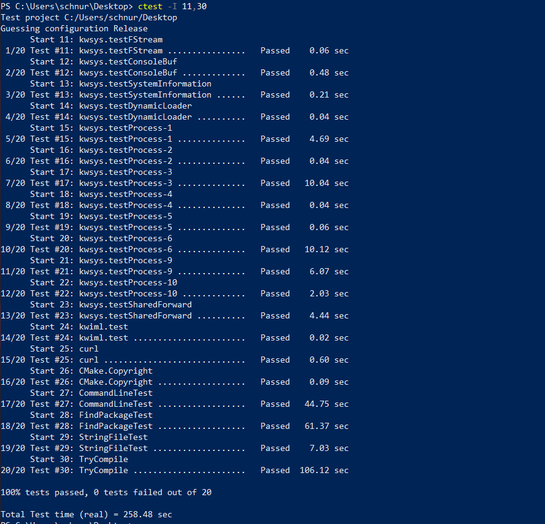

# Lab 7

## Getting Started

## Executing the Tests

Nightly and Experimental: You can see the test by clicking on number in fail and pass colomn tests passed and see which where ran

Finding Errors: Error condition "	
*** ERROR executing: No such file or directory". This helps identify the issue

Nightly Expected: found terfin.kitware	platformvs9-32-ide which failed a test named Module.ExternalData

## Failing/Passing a Test

## CI/CD
Not included